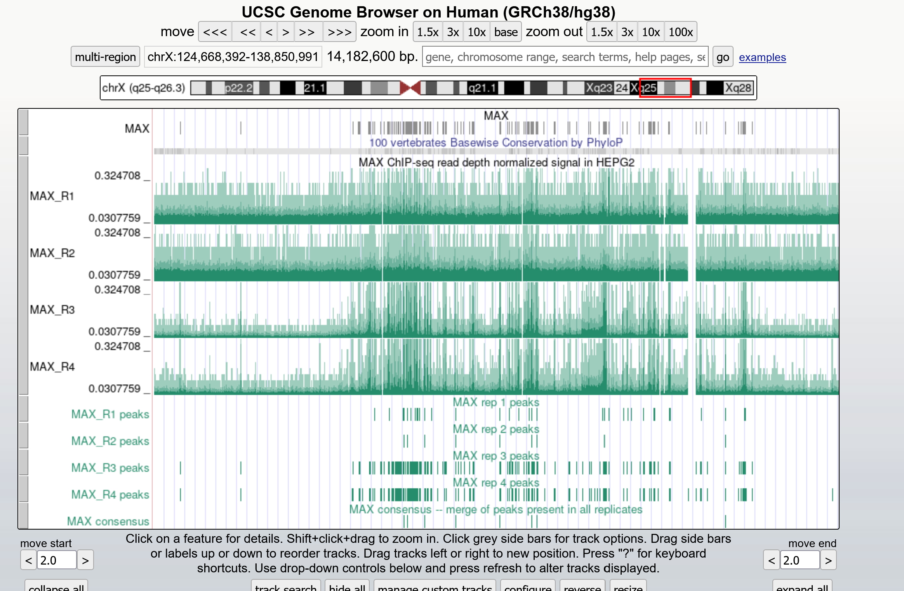
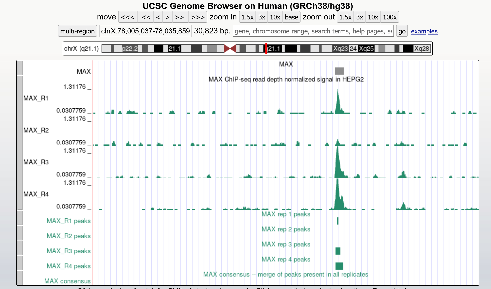

# Load the libraries you need
# Load functions you need "my_class_functions"
```{r setup, include=FALSE}
knitr::opts_chunk$set(echo = TRUE)
library(GenomicRanges)
library(tidyverse)
library(IRanges)
library(ggplot2)
source("../../util/my_class_functions.R")
source("../../util/plotting_functions.R")
source("../../util/_setup.R")

```


# load in your peak files for each replicate of each protein
# Here I am starting to analyze my data for my proteins of interest:
# BRCA1, H3K36me3, JUN, MAX, POLR2A, POLR2AphosphoS2, POLR2AphosphoS5, TBP
# First I will read in each replicate file
```{r load in peak files}

basepath <- "/scratch/Shares/rinnclass/CLASS_2023/chipseqprofs"
peak_path <- "results/bwa/mergedLibrary/macs/broadPeak_good_files/"
broadpeakfilepath <- file.path(basepath, peak_path)

peak_list <- import_peaks(consensus_file_path = broadpeakfilepath)
peak_num <- sapply(peak_list, length) %>% as.data.frame() # omitted row.names=T
# label column
names(peak_num) <- c("num_peaks")

# make dbp name a col.
peak_num <- peak_num %>%
  rownames_to_column(var = "dbp") %>%
  separate(col = dbp,  into = c('dbp', 'replicate'), sep = "_")

# printing out a table of the number of peaks in each file:
peak_num

```


# Now I am going to create consensus peaks for each protein
```{r consensus peaks}

dbps <- unique(sapply(names(peak_list), function(x) {
   unlist(strsplit(x, "_"))[1]
}))

consensus_list <- lapply(dbps, consensus_from_reduced, peak_list)
names(consensus_list) <- dbps

# export consensus peaks to results folder
basepath <- "/scratch/Shares/rinnclass/CLASS_2023/lucyvk"
consensus_path <- "CLASS_2023/CLASSES/05_R_analyses/class_exercise_results/consensus_peaks/"
exportpath <- file.path(basepath, consensus_path)
for(i in 1:length(consensus_list)) {
rtracklayer::export(consensus_list[[i]], paste0(exportpath, names(consensus_list)[i], "_consensus_peaks.bed") )}

```

# Now I am going to make my consensus peaks compatable with UCSC genome browser
```{r}

consensus_file_list <- list.files("/scratch/Shares/rinnclass/CLASS_2023/lucyvk/CLASS_2023/CLASSES/05_R_analyses/class_exercise_results/consensus_peaks", full.names = T, pattern = ".bed")

peaks <- lapply(consensus_file_list, read.table, col.names = c("chr", "start", "end", "name", "score", "strand"))
names(peaks) <- dbps

canonical_chr <- c(paste0("chr", 1:22), "chrM", "chrX", "chrY")
peaks <- lapply(peaks, function(x) x %>% filter(chr %in% canonical_chr))

# print out consensus peak files in a results/UCSC directory
basepath <- "/scratch/Shares/rinnclass/CLASS_2023/lucyvk"
consensus_path <- "CLASS_2023/CLASSES/05_R_analyses/class_exercise_results/UCSC_consensus_peaks/"
exportpath <- file.path(basepath, consensus_path)
new_filenames <- paste0(exportpath, names(peaks), "_consensus_peaks.bed")
for(i in 1:length(peaks)) {
  write.table(peaks[[i]], new_filenames[[i]],
              sep = "\t", col.names = FALSE, row.names = FALSE,
              quote = FALSE, append = TRUE)
}

```

# I am curious if my proteins are transcription factors so I will use the annotations
# in a cell paper I found and see

```{r}

tf_file_location <- "/scratch/Shares/rinnclass/CLASS_2023/lucyvk/CLASS_2023/CLASSES/05_R_analyses/01_peak_features/results/TF_annotations.xlsx"
human_tfs <- readxl::read_excel(tf_file_location,sheet = 2, skip = 1)
# filter to only the proteins we care about
human_tfs <- human_tfs[tolower(human_tfs$Name) %in% tolower(dbps),1:4]
names(human_tfs) <- c("ensemble_id","dbp","dbd","is_tf")

consensus_info <- data.frame("dbp" = names(consensus_list),"num_consensus_peaks" = sapply(consensus_list, length))
consensus_info$total_peak_length <- sapply(consensus_list, function(x) sum(width(x)))
consensus_info <- merge(consensus_info, human_tfs, all.x = T)
consensus_info

```


# Now I want to compare a protein with a previous analysis 
```{r}

# I've provided screenshots for the comparison to MAX in the class_exercise_results folder. They look like they generally align!




```


# Now I am going to determine how my peaks for each protein overlap annotations of the genome
# First I will find the overlaps between my consensus peaks with promoters of lncRNA and mRNA promoters

```{r}

lncrna_mrna_promoters_location <-"/scratch/Shares/rinnclass/CLASS_2023/lucyvk/CLASS_2023/CLASSES/05_R_analyses/01_peak_features/results/gene_annotations/lncrna_mrna_promoters.gtf"
lncrna_mrna_promoters <- rtracklayer::import(lncrna_mrna_promoters_location)

promoter_peak_counts <- count_peaks_per_feature(lncrna_mrna_promoters, consensus_list, type = "counts")
# cols are promoters, rows are DBPS
consensus_info$peaks_overlapping_promoters <- rowSums(promoter_peak_counts)
consensus_info <- consensus_info %>%
  mutate(percent_promoter_overlap = peaks_overlapping_promoters/num_consensus_peaks)
select(consensus_info,dbp,num_consensus_peaks,peaks_overlapping_promoters,percent_promoter_overlap)

```

## results: 
# 1) What can you determine from these overlaps?
# Sometimes the number of peaks overlapping promoters is greater than the number of peaks (promoters can overlap)
# TBP and POLR2A overlap promoters (basically exclusively)

# Now I want to compare the overlaps with lncRNA and mRNA promoters seperately 
```{r}

mrna_lncrna_gene_location <-"/scratch/Shares/rinnclass/CLASS_2023/lucyvk/CLASS_2023/CLASSES/05_R_analyses/01_peak_features/results/gene_annotations/mrna_lncrna_genes.gtf"
mrna_lncrna_genes <- rtracklayer::import(mrna_lncrna_gene_location)
lncrna_gene_ids <- mrna_lncrna_genes$gene_id[mrna_lncrna_genes$gene_type == "lncRNA"]
mrna_gene_ids <- mrna_lncrna_genes$gene_id[mrna_lncrna_genes$gene_type == "protein_coding"]

consensus_info$peaks_overlapping_lncrna_promoters <- rowSums(promoter_peak_counts[,lncrna_gene_ids])
consensus_info$peaks_overlapping_mrna_promoters <- rowSums(promoter_peak_counts[,mrna_gene_ids])
consensus_info <- consensus_info %>%
  mutate(percent_lncrna_promoter_overlap = peaks_overlapping_lncrna_promoters/num_consensus_peaks)
consensus_info <- consensus_info %>%
  mutate(percent_mrna_promoter_overlap = peaks_overlapping_mrna_promoters/num_consensus_peaks)
select(consensus_info, dbp,peaks_overlapping_lncrna_promoters,percent_lncrna_promoter_overlap,peaks_overlapping_mrna_promoters,percent_mrna_promoter_overlap)

```
## results:
# 1) What is the difference in overlaps between mRNA and lncRNA promoters
# In general, there appears to be more overlap with mrna promoters, particularly for those proteins with lots of promoter overlaps

# Now I am going to test if there is more binding over gene bodies than promoters
# I will seperate lncRNA and mRNA gene bodies to find the overlaps 

```{r}

genebody_peak_counts <- count_peaks_per_feature(mrna_lncrna_genes, consensus_list, type = "counts")
consensus_info$peaks_overlapping_genebody <- rowSums(genebody_peak_counts)
consensus_info$peaks_overlapping_lncrna_genebody <- rowSums(genebody_peak_counts[,lncrna_gene_ids])
consensus_info$peaks_overlapping_mrna_genebody <- rowSums(genebody_peak_counts[,mrna_gene_ids])

# Also write this to file
consensus_path <- "/CLASS_2023/CLASSES/05_R_analyses/class_exercise_results/"
write_csv(consensus_info, paste0(basepath,consensus_path,"consensus_info.csv"))

select(consensus_info,dbp,num_consensus_peaks,peaks_overlapping_promoters,peaks_overlapping_genebody,peaks_overlapping_lncrna_genebody,peaks_overlapping_mrna_genebody)

```
## results: 
# 1) Do my proteins have more overlaps with promoters or genebodies?
# There are more overlaps with gene bodies, most of which are for mrna genebodies

# It is nice and all to find overlaps, but I am interested in how many proteins
# bind a specific promoter. I will use my handy "occurence" parameter in 
# " count peaks per feature" 

```{r}

# find overlaps of promoters for each protein
promoter_peak_occurence <- count_peaks_per_feature(lncrna_mrna_promoters, consensus_list, type = "occurrence")
stopifnot(all(colnames(promoter_peak_occurence) == lncrna_mrna_promoters$gene_id)) # check
res_path <- "/CLASS_2023/CLASSES/05_R_analyses/class_exercise_results/promoter_overlap/"
write.table(promoter_peak_occurence, paste0(basepath,res_path,"lncrna_mrna_promoter_peak_occurence_matrix.tsv"))

peak_occurence_df <- data.frame("gene_id" = colnames(promoter_peak_occurence),
                                "gene_name" = lncrna_mrna_promoters$gene_name,
                                "gene_type" = lncrna_mrna_promoters$gene_type,
                                "chr" = lncrna_mrna_promoters@seqnames,   
                                "1kb_up_tss_start" = lncrna_mrna_promoters@ranges@start,
                                "strand" = lncrna_mrna_promoters@strand,
                                "number_of_dbp" = colSums(promoter_peak_occurence))

max(peak_occurence_df$number_of_dbp)
```
## results: I find the max number of proteins on a promoter to be 8 (all of them!)

# Now I want to start plotting my results
# First I will see if there is a realtionship between peak number and total DNA covered
# It looks like, yes, the general pattern of a linear increase holds in this sample of 8 proteins
```{r}

consensus_info <- read_csv('class_exercise_results/consensus_info.csv',show_col_types = FALSE)
ggplot(consensus_info, aes(x = num_consensus_peaks, y = total_peak_length)) +
  geom_point() 

```

# Now I want to color my plot by wether the protein is a TF or not.
```{r}

ggplot(consensus_info, aes(x = num_consensus_peaks, 
                           y = total_peak_length,
                           color = is_tf == "Yes")) +
  geom_point() 

```

# I want to make a histogram of the number of peaks for each of my proteins

```{r}

# there are only 8 proteins so grouping into 4 bins
ggplot(consensus_info, aes(x = num_consensus_peaks)) +
  geom_histogram(bins = 4)

```


# Now I want to facet this by the type of DNA binding domain my protein has.
# The ones with NA for this column seem to have more peaks
```{r}

ggplot(consensus_info, aes(x = num_consensus_peaks)) +
  geom_histogram(bins = 4) +
  facet_wrap(dbd ~ ., nrow = 5, ncol = 1)

```


# Cool now I am ready to send my result to my collaborator as a
# Knitted document

