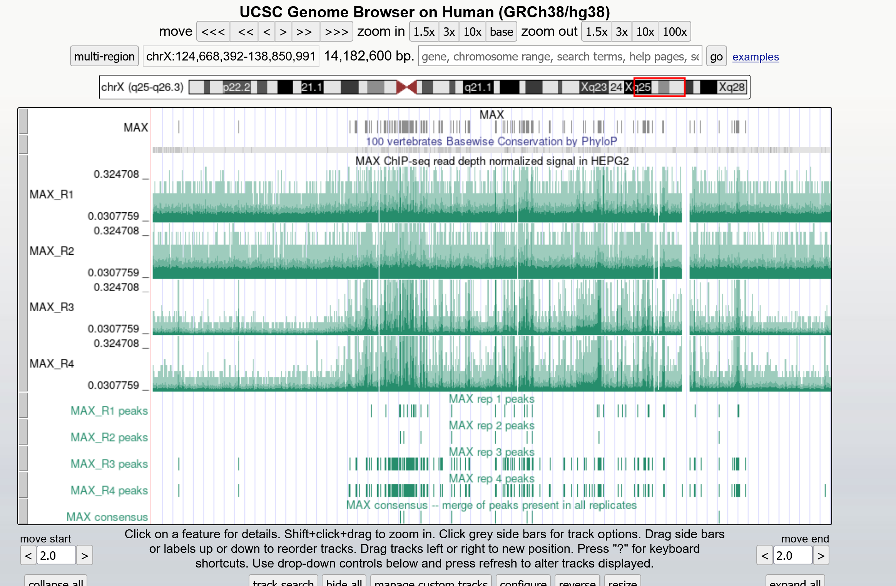
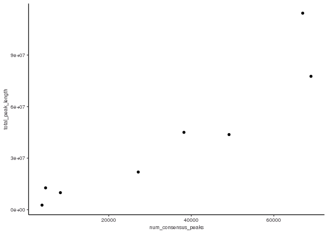

Class\_exercise
================
Lucy VK
3/16/2023

# Load the libraries you need

# Load functions you need “my\_class\_functions”

# load in your peak files for each replicate of each protein

# Here I am starting to analyze my data for my proteins of interest:

# BRCA1, H3K36me3, JUN, MAX, POLR2A, POLR2AphosphoS2, POLR2AphosphoS5, TBP

# First I will read in each replicate file

``` r
basepath <- "/scratch/Shares/rinnclass/CLASS_2023/chipseqprofs"
peak_path <- "results/bwa/mergedLibrary/macs/broadPeak_good_files/"
broadpeakfilepath <- file.path(basepath, peak_path)

peak_list <- import_peaks(consensus_file_path = broadpeakfilepath)
peak_num <- sapply(peak_list, length) %>% as.data.frame() # omitted row.names=T
# label column
names(peak_num) <- c("num_peaks")

# make dbp name a col.
peak_num <- peak_num %>%
  rownames_to_column(var = "dbp") %>%
  separate(col = dbp,  into = c('dbp', 'replicate'), sep = "_")

# printing out a table of the number of peaks in each file:
peak_num
```

    ##                dbp replicate num_peaks
    ## 1            BRCA1        R3     44978
    ## 2            BRCA1        R4     44173
    ## 3         H3K36me3        R1    173838
    ## 4         H3K36me3        R2    175056
    ## 5         H3K36me3        R4    148235
    ## 6              JUN        R1     17007
    ## 7              JUN        R2     35109
    ## 8              JUN        R3     40224
    ## 9              JUN        R4     24645
    ## 10             MAX        R3     83146
    ## 11             MAX        R4    113543
    ## 12          POLR2A        R1     28136
    ## 13          POLR2A        R2     29601
    ## 14          POLR2A        R3     16204
    ## 15          POLR2A        R4     15515
    ## 16 POLR2AphosphoS2        R1     64499
    ## 17 POLR2AphosphoS2        R2     99880
    ## 18 POLR2AphosphoS5        R1     91908
    ## 19 POLR2AphosphoS5        R2     89007
    ## 20             TBP        R1     22070
    ## 21             TBP        R2     18302
    ## 22             TBP        R3     51536
    ## 23             TBP        R4     33932

# Now I am going to create consensus peaks for each protein

``` r
dbps <- unique(sapply(names(peak_list), function(x) {
   unlist(strsplit(x, "_"))[1]
}))

consensus_list <- lapply(dbps, consensus_from_reduced, peak_list)
names(consensus_list) <- dbps

# export consensus peaks to results folder
basepath <- "/scratch/Shares/rinnclass/CLASS_2023/lucyvk"
consensus_path <- "CLASS_2023/CLASSES/05_R_analyses/class_exercise_results/consensus_peaks/"
exportpath <- file.path(basepath, consensus_path)
for(i in 1:length(consensus_list)) {
rtracklayer::export(consensus_list[[i]], paste0(exportpath, names(consensus_list)[i], "_consensus_peaks.bed") )}
```

# Now I am going to make my consensus peaks compatable with UCSC genome browser

``` r
consensus_file_list <- list.files("/scratch/Shares/rinnclass/CLASS_2023/lucyvk/CLASS_2023/CLASSES/05_R_analyses/class_exercise_results/consensus_peaks", full.names = T, pattern = ".bed")

peaks <- lapply(consensus_file_list, read.table, col.names = c("chr", "start", "end", "name", "score", "strand"))
names(peaks) <- dbps

canonical_chr <- c(paste0("chr", 1:22), "chrM", "chrX", "chrY")
peaks <- lapply(peaks, function(x) x %>% filter(chr %in% canonical_chr))

# print out consensus peak files in a results/UCSC directory
basepath <- "/scratch/Shares/rinnclass/CLASS_2023/lucyvk"
consensus_path <- "CLASS_2023/CLASSES/05_R_analyses/class_exercise_results/UCSC_consensus_peaks/"
exportpath <- file.path(basepath, consensus_path)
new_filenames <- paste0(exportpath, names(peaks), "_consensus_peaks.bed")
for(i in 1:length(peaks)) {
  write.table(peaks[[i]], new_filenames[[i]],
              sep = "\t", col.names = FALSE, row.names = FALSE,
              quote = FALSE, append = TRUE)
}
```

# I am curious if my proteins are transcription factors so I will use the annotations

# in a cell paper I found and see

``` r
tf_file_location <- "/scratch/Shares/rinnclass/CLASS_2023/lucyvk/CLASS_2023/CLASSES/05_R_analyses/01_peak_features/results/TF_annotations.xlsx"
human_tfs <- readxl::read_excel(tf_file_location,sheet = 2, skip = 1)
```

    ## Warning: Expecting logical in M1006 / R1006C13: got 'Contains a SANT and
    ## multiple DNA-binding C2H2 domains. Motif is 99% AA ID from mouse (Transfac).'

    ## Warning: Expecting logical in M1021 / R1021C13: got 'Close ortholog (PP1RA)
    ## binds to mRNA; single-stranded DNA (ssDNA); poly(A) and poly(G) homopolymers
    ## (Uniprot)'

    ## Warning: Expecting logical in M1542 / R1542C13: got 'Contains 1 SANT domain'

    ## Warning: Expecting logical in M1543 / R1543C13: got 'Contains 2 Myb DBDs.
    ## Sources of Hocomoco/Transfac motifs are unclear. However these sequences look
    ## similar to in vitro sites selected by SELEX (PMID:11082045)'

    ## Warning: Expecting logical in M1544 / R1544C13: got 'Although CHD2 has weak
    ## similarity to a Myb domain (PMID:9326634), it's more closely related to the
    ## non-DNA-binding SANT domain based on our alignment analysis. The data showing
    ## that show that CHD2 binding histone H3.3 (PMID:22569126) further support the
    ## conclusion that the Myb domain is probably a SANT domain facilitating the
    ## histone interaction'

    ## Warning: Expecting logical in M1545 / R1545C13: got 'Contains a single SANT
    ## domain, no evidence for sequence-specific DNA binding'

    ## Warning: Expecting logical in M1546 / R1546C13: got 'Contains 2 Myb DBDs'

    ## Warning: Expecting logical in M1547 / R1547C13: got 'Contains 2 SANT domains,
    ## and no other putative DNA-binding domains'

    ## Warning: Expecting logical in M1548 / R1548C13: got 'Contains 2 SANT domains,
    ## and no other putative DNA-binding domains'

    ## Warning: Expecting logical in M1549 / R1549C13: got 'Contains a single SANT
    ## domain, no evidence for sequence-specific DNA binding'

    ## Warning: Expecting logical in M1550 / R1550C13: got 'Domain is truncated, and
    ## there is nothing known about this gene'

    ## Warning: Expecting logical in M1551 / R1551C13: got 'Contains a single SANT
    ## domain, no evidence for sequence-specific DNA binding'

    ## Warning: Expecting logical in M1552 / R1552C13: got 'MIER2's Myb domain is more
    ## similar to the non-DNA-binding SANT domain'

    ## Warning: Expecting logical in M1553 / R1553C13: got 'MIER3's Myb domain is more
    ## similar to the non-DNA-binding SANT domain'

    ## Warning: Expecting logical in M1554 / R1554C13: got 'Contains 1 SANT domain,
    ## and a SANTA domain'

    ## Warning: Expecting logical in M1555 / R1555C13: got 'Contains a single Myb-like
    ## domain with an insertion in the middle. It is ambiguous whether Myb-like
    ## domains are DNA or protein binding. Since it has a single domain it's likely
    ## non-specific, but future experiments should be performed to assay it's
    ## specificity'

    ## Warning: Expecting logical in M1556 / R1556C13: got 'Contains 3 Myb DBDs'

    ## Warning: Expecting logical in M1557 / R1557C13: got 'Contains 3 Myb DBDs'

    ## Warning: Expecting logical in M1558 / R1558C13: got 'Contains 3 Myb DBDs'

    ## Warning: Expecting logical in M1559 / R1559C13: got 'Contains a single Myb-like
    ## domain. Mouse ortholog has motif'

    ## Warning: Expecting logical in M1560 / R1560C13: got 'MYSM1 has been shown to
    ## bind DNA ? interaction with DNA requires the MYSM1 Myb but not the SWIRM domain
    ## (PMID:17428495). Domain sequence alignment places it near DNA-binding Myb
    ## domains but scores slightly higher as a SANT rather than Myb domain based on
    ## Prosite patterns. Given that most Myb proteins that bind DNA sequence
    ## specifically have multiple Myb domains in an array this protein could bind DNA
    ## sequence non-specifically with it?s single Myb domain. Future experiments
    ## should assay MYSM1?s specificity'

    ## Warning: Expecting logical in M1561 / R1561C13: got 'Contains 2 SANT domains,
    ## and no other putative DNA-binding domains'

    ## Warning: Expecting logical in M1562 / R1562C13: got 'Contains 2 SANT domains,
    ## and no other putative DNA-binding domains'

    ## Warning: Expecting logical in M1564 / R1564C13: got 'Contains 2 SANT domains,
    ## and no other putative DNA-binding domains'

    ## Warning: Expecting logical in M1565 / R1565C13: got 'Contains 2 SANT domains,
    ## and no other putative DNA-binding domains'

    ## Warning: Expecting logical in M1566 / R1566C13: got 'Contains 2 SANT domains,
    ## and no other putative DNA-binding domains. RCOR3 SANT domains are known to
    ## facilitate PPIs'

    ## Warning: Expecting logical in M1567 / R1567C13: got 'SMARCA1 contains a
    ## truncated Myb-like and SANT domain. Given the presence of the Myb-like domain,
    ## and other domains known to associated with DNA (DEAD box helicase) it likely
    ## associates with DNA non-sequence-specifically'

    ## Warning: Expecting logical in M1568 / R1568C13: got 'Contains a SANT, and
    ## Myb-like domain'

    ## Warning: Expecting logical in M1569 / R1569C13: got 'Contains 1 SANT domain,
    ## and no other putative DNA-binding domains. Motif logos look like bZIP dimeric
    ## binding sites, and are thus likely specificifities of SMARCC1 interactors'

    ## Warning: Expecting logical in M1570 / R1570C13: got 'Contains 1 SANT domain,
    ## and no other putative DNA-binding domains. Motif logos ares likely
    ## specificifities of SMARCC2 interactors'

    ## Warning: Expecting logical in M1571 / R1571C13: got 'Contains only Myb DBDs'

    ## Warning: Expecting logical in M1572 / R1572C13: got 'Contains 1 SANT domain'

    ## Warning: Expecting logical in M1573 / R1573C13: got 'TADA2B contains a single
    ## SANT domain and is thus unlikely to bind DNA'

    ## Warning: Expecting logical in M1574 / R1574C13: got 'Contains a single Myb
    ## domain (with slightly less simialrity to a SANT domain.) This domain has been
    ## shown to be involved in PPIs but this may not be mutually exclusive with
    ## DNA-binding. The sequence-specificity of CCDC79 should be investigated in the
    ## future'

    ## Warning: Expecting logical in M1575 / R1575C13: got 'Contains 1 Myb domain, and
    ## has structural evidence of DNA-binding'

    ## Warning: Expecting logical in M1576 / R1576C13: got 'Motif is inferred from
    ## mouse (92% DBD AA ID)'

    ## Warning: Expecting logical in M1577 / R1577C13: got 'TERF2IP contains a single
    ## Myb-like domain. While it's unclear if TERF2IP (Human Rap1) contacts DNA
    ## directly it has been shown to affect the DNA binding activity of TRF2'

    ## Warning: Expecting logical in M1578 / R1578C13: got 'This protein contains Myb,
    ## and Myb-like domains and is annotated as a Pol1 terminator. TTF1 DNA-binding
    ## has been demonstrated in vitro (PMID: 7597036), but it's specificity has not
    ## been determined'

    ## Warning: Expecting logical in M1579 / R1579C13: got 'Contains 1 Myb DBD'

    ## Warning: Expecting logical in M1580 / R1580C13: got 'Contains a GATA and SANT
    ## domain. Unclear whether the GATA domain is a bona fide DBD as the MTA/RERE
    ## family domains are atypical to human GATA domains (see alignment). In CIS-BP
    ## there is one protein from C.elegans that shares domain homology and binds a
    ## GATA motif (elg-27, ChIP-seq). The GATA ZnF domain of MTA1 is required for it's
    ## interaction with RBBP4 and RBBP7 (PMID:18067919). Full-length protein has been
    ## tried in HT-SELEX and did not yield a motif'

    ## Warning: Expecting logical in M1581 / R1581C13: got 'Contains a GATA and SANT
    ## domain. Unclear whether the GATA domain is a bona fide DBD as the MTA/RERE
    ## family domains are atypical to human GATA domains (see alignment). In CIS-BP
    ## there is one protein from C.elegans that shares domain homology and binds a
    ## GATA motif (elg-27, ChIP-seq). Full-length protein has been tried in HT-SELEX,
    ## and DBD has been tried on PBM - neither yielded motifs'

    ## Warning: Expecting logical in M1582 / R1582C13: got 'Contains a GATA and SANT
    ## domain. Unclear whether the GATA domain is a bona fide DBD as the MTA/RERE
    ## family domains are atypical to human GATA domains (see alignment). In CIS-BP
    ## there is one protein from C.elegans that shares domain homology and binds a
    ## GATA motif (elg-27, ChIP-seq). Hasn't been tried in any in vitro assays'

    ## Warning: Expecting logical in M1583 / R1583C13: got 'Contains a GATA and SANT
    ## domain. Unclear whether the GATA domain is a bona fide DBD as the MTA/RERE
    ## family domains are atypical to human GATA domains (see alignment). In CIS-BP
    ## there is one protein from C.elegans that shares domain homology and binds a
    ## GATA motif (elg-27, ChIP-seq). Has been tried as a DBD in HT-SELEX but did not
    ## yield a motif'

    ## Warning: Expecting logical in M1791 / R1791C13: got 'CNOT3 is a part of the
    ## CCR4-NOT complex involved in mRNA decay'

    ## Warning: Expecting logical in M1932 / R1932C13: got '"Prosite identifies a
    ## low-confidence Myb-like domain (e.g. can?t decide between Myb and SANT) so it?s
    ## probably not a TF"'

    ## New names:
    ## • `` -> `...4`

``` r
# filter to only the proteins we care about
human_tfs <- human_tfs[tolower(human_tfs$Name) %in% tolower(dbps),1:4]
names(human_tfs) <- c("ensemble_id","dbp","dbd","is_tf")

consensus_info <- data.frame("dbp" = names(consensus_list),"num_consensus_peaks" = sapply(consensus_list, length))
consensus_info$total_peak_length <- sapply(consensus_list, function(x) sum(width(x)))
consensus_info <- merge(consensus_info, human_tfs, all.x = T)
consensus_info
```

    ##               dbp num_consensus_peaks total_peak_length     ensemble_id     dbd
    ## 1           BRCA1               27154          21930858 ENSG00000012048 Unknown
    ## 2        H3K36me3               66997         114382144            <NA>    <NA>
    ## 3             JUN                3835           2670049 ENSG00000177606    bZIP
    ## 4             MAX               69006          77629013 ENSG00000125952    bHLH
    ## 5          POLR2A                4700          12715914 ENSG00000181222 Unknown
    ## 6 POLR2AphosphoS2               38221          45021137            <NA>    <NA>
    ## 7 POLR2AphosphoS5               49152          43730816            <NA>    <NA>
    ## 8             TBP                8288           9923640 ENSG00000112592     TBP
    ##   is_tf
    ## 1    No
    ## 2  <NA>
    ## 3   Yes
    ## 4   Yes
    ## 5    No
    ## 6  <NA>
    ## 7  <NA>
    ## 8   Yes

# Now I want to compare a protein with a previous analysis

``` r
# I've provided screenshots for the comparison to MAX in the class_exercise_results folder. They look like they generally align!


```


``` r
knitr::include_graphics("MAX_Browser2.png")
```


# Now I am going to determine how my peaks for each protein overlap annotations of the genome

# First I will find the overlaps between my consensus peaks with promoters of lncRNA and mRNA promoters

``` r
lncrna_mrna_promoters_location <-"/scratch/Shares/rinnclass/CLASS_2023/lucyvk/CLASS_2023/CLASSES/05_R_analyses/01_peak_features/results/gene_annotations/lncrna_mrna_promoters.gtf"
lncrna_mrna_promoters <- rtracklayer::import(lncrna_mrna_promoters_location)

promoter_peak_counts <- count_peaks_per_feature(lncrna_mrna_promoters, consensus_list, type = "counts")
# cols are promoters, rows are DBPS
consensus_info$peaks_overlapping_promoters <- rowSums(promoter_peak_counts)
consensus_info <- consensus_info %>%
  mutate(percent_promoter_overlap = peaks_overlapping_promoters/num_consensus_peaks)
select(consensus_info,dbp,num_consensus_peaks,peaks_overlapping_promoters,percent_promoter_overlap)
```

    ##               dbp num_consensus_peaks peaks_overlapping_promoters
    ## 1           BRCA1               27154                       14420
    ## 2        H3K36me3               66997                        2179
    ## 3             JUN                3835                         700
    ## 4             MAX               69006                       18524
    ## 5          POLR2A                4700                        5102
    ## 6 POLR2AphosphoS2               38221                        8411
    ## 7 POLR2AphosphoS5               49152                       17143
    ## 8             TBP                8288                        8480
    ##   percent_promoter_overlap
    ## 1               0.53104515
    ## 2               0.03252384
    ## 3               0.18252934
    ## 4               0.26844043
    ## 5               1.08553191
    ## 6               0.22006227
    ## 7               0.34877523
    ## 8               1.02316602

## results:

# 1) What can you determine from these overlaps?

# Sometimes the number of peaks overlapping promoters is greater than the number of peaks (promoters can overlap)

# TBP and POLR2A overlap promoters (basically exclusively)

# Now I want to compare the overlaps with lncRNA and mRNA promoters seperately

``` r
mrna_lncrna_gene_location <-"/scratch/Shares/rinnclass/CLASS_2023/lucyvk/CLASS_2023/CLASSES/05_R_analyses/01_peak_features/results/gene_annotations/mrna_lncrna_genes.gtf"
mrna_lncrna_genes <- rtracklayer::import(mrna_lncrna_gene_location)
lncrna_gene_ids <- mrna_lncrna_genes$gene_id[mrna_lncrna_genes$gene_type == "lncRNA"]
mrna_gene_ids <- mrna_lncrna_genes$gene_id[mrna_lncrna_genes$gene_type == "protein_coding"]

consensus_info$peaks_overlapping_lncrna_promoters <- rowSums(promoter_peak_counts[,lncrna_gene_ids])
consensus_info$peaks_overlapping_mrna_promoters <- rowSums(promoter_peak_counts[,mrna_gene_ids])
consensus_info <- consensus_info %>%
  mutate(percent_lncrna_promoter_overlap = peaks_overlapping_lncrna_promoters/num_consensus_peaks)
consensus_info <- consensus_info %>%
  mutate(percent_mrna_promoter_overlap = peaks_overlapping_mrna_promoters/num_consensus_peaks)
select(consensus_info, dbp,peaks_overlapping_lncrna_promoters,percent_lncrna_promoter_overlap,peaks_overlapping_mrna_promoters,percent_mrna_promoter_overlap)
```

    ##               dbp peaks_overlapping_lncrna_promoters
    ## 1           BRCA1                               3388
    ## 2        H3K36me3                               1561
    ## 3             JUN                                231
    ## 4             MAX                               5171
    ## 5          POLR2A                               1248
    ## 6 POLR2AphosphoS2                               2662
    ## 7 POLR2AphosphoS5                               4413
    ## 8             TBP                               1756
    ##   percent_lncrna_promoter_overlap peaks_overlapping_mrna_promoters
    ## 1                      0.12476983                            11032
    ## 2                      0.02329955                              618
    ## 3                      0.06023468                              469
    ## 4                      0.07493551                            13353
    ## 5                      0.26553191                             3854
    ## 6                      0.06964758                             5749
    ## 7                      0.08978271                            12730
    ## 8                      0.21187259                             6724
    ##   percent_mrna_promoter_overlap
    ## 1                   0.406275319
    ## 2                   0.009224294
    ## 3                   0.122294654
    ## 4                   0.193504913
    ## 5                   0.820000000
    ## 6                   0.150414693
    ## 7                   0.258992513
    ## 8                   0.811293436

## results:

# 1) What is the difference in overlaps between mRNA and lncRNA promoters

# In general, there appears to be more overlap with mrna promoters, particularly for those proteins with lots of promoter overlaps

# Now I am going to test if there is more binding over gene bodies than promoters

# I will seperate lncRNA and mRNA gene bodies to find the overlaps

``` r
genebody_peak_counts <- count_peaks_per_feature(mrna_lncrna_genes, consensus_list, type = "counts")
consensus_info$peaks_overlapping_genebody <- rowSums(genebody_peak_counts)
consensus_info$peaks_overlapping_lncrna_genebody <- rowSums(genebody_peak_counts[,lncrna_gene_ids])
consensus_info$peaks_overlapping_mrna_genebody <- rowSums(genebody_peak_counts[,mrna_gene_ids])

# Also write this to file
consensus_path <- "/CLASS_2023/CLASSES/05_R_analyses/class_exercise_results/"
write_csv(consensus_info, paste0(basepath,consensus_path,"consensus_info.csv"))

select(consensus_info,dbp,num_consensus_peaks,peaks_overlapping_promoters,peaks_overlapping_genebody,peaks_overlapping_lncrna_genebody,peaks_overlapping_mrna_genebody)
```

    ##               dbp num_consensus_peaks peaks_overlapping_promoters
    ## 1           BRCA1               27154                       14420
    ## 2        H3K36me3               66997                        2179
    ## 3             JUN                3835                         700
    ## 4             MAX               69006                       18524
    ## 5          POLR2A                4700                        5102
    ## 6 POLR2AphosphoS2               38221                        8411
    ## 7 POLR2AphosphoS5               49152                       17143
    ## 8             TBP                8288                        8480
    ##   peaks_overlapping_genebody peaks_overlapping_lncrna_genebody
    ## 1                      26993                              5587
    ## 2                      76443                              5469
    ## 3                       3328                               842
    ## 4                      60723                             13659
    ## 5                       7087                              1431
    ## 6                      42324                              5041
    ## 7                      53738                              8163
    ## 8                      11110                              2070
    ##   peaks_overlapping_mrna_genebody
    ## 1                           21406
    ## 2                           70974
    ## 3                            2486
    ## 4                           47064
    ## 5                            5656
    ## 6                           37283
    ## 7                           45575
    ## 8                            9040

## results:

# 1) Do my proteins have more overlaps with promoters or genebodies?

# There are more overlaps with gene bodies, most of which are for mrna genebodies

# It is nice and all to find overlaps, but I am interested in how many proteins

# bind a specific promoter. I will use my handy “occurence” parameter in

# " count peaks per feature"

``` r
# find overlaps of promoters for each protein
promoter_peak_occurence <- count_peaks_per_feature(lncrna_mrna_promoters, consensus_list, type = "occurrence")
stopifnot(all(colnames(promoter_peak_occurence) == lncrna_mrna_promoters$gene_id)) # check
res_path <- "/CLASS_2023/CLASSES/05_R_analyses/class_exercise_results/promoter_overlap/"
write.table(promoter_peak_occurence, paste0(basepath,res_path,"lncrna_mrna_promoter_peak_occurence_matrix.tsv"))

peak_occurence_df <- data.frame("gene_id" = colnames(promoter_peak_occurence),
                                "gene_name" = lncrna_mrna_promoters$gene_name,
                                "gene_type" = lncrna_mrna_promoters$gene_type,
                                "chr" = lncrna_mrna_promoters@seqnames,   
                                "1kb_up_tss_start" = lncrna_mrna_promoters@ranges@start,
                                "strand" = lncrna_mrna_promoters@strand,
                                "number_of_dbp" = colSums(promoter_peak_occurence))

max(peak_occurence_df$number_of_dbp)
```

    ## [1] 8

## results: I find the max number of proteins on a promoter to be 8 (all of them!)

# Now I want to start plotting my results

# First I will see if there is a realtionship between peak number and total DNA covered

# It looks like, yes, the general pattern of a linear increase holds in this sample of 8 proteins

``` r
consensus_info <- read_csv('class_exercise_results/consensus_info.csv',show_col_types = FALSE)
ggplot(consensus_info, aes(x = num_consensus_peaks, y = total_peak_length)) +
  geom_point() 
```

<!-- -->

# Now I want to color my plot by wether the protein is a TF or not.

``` r
ggplot(consensus_info, aes(x = num_consensus_peaks, 
                           y = total_peak_length,
                           color = is_tf == "Yes")) +
  geom_point() 
```

<!-- -->

# I want to make a histogram of the number of peaks for each of my proteins

``` r
# there are only 8 proteins so grouping into 4 bins
ggplot(consensus_info, aes(x = num_consensus_peaks)) +
  geom_histogram(bins = 4)
```

<!-- -->

# Now I want to facet this by the type of DNA binding domain my protein has.

# The ones with NA for this column seem to have more peaks

``` r
ggplot(consensus_info, aes(x = num_consensus_peaks)) +
  geom_histogram(bins = 4) +
  facet_wrap(dbd ~ ., nrow = 5, ncol = 1)
```

<!-- -->

# Cool now I am ready to send my result to my collaborator as a

# Knitted document
