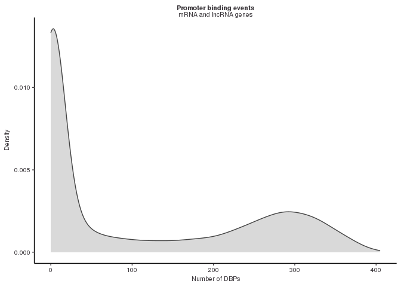
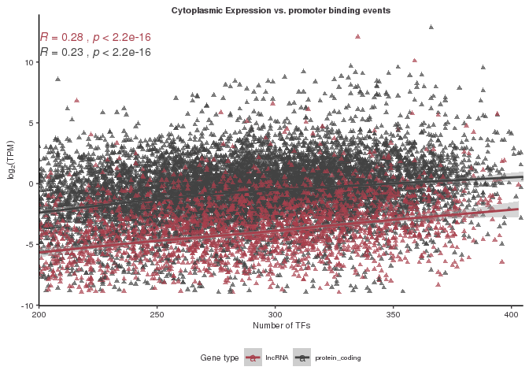

Lucy\_VK\_Final\_Project
================
lucyvk
5/1/2023


    In this file, we analyse data from all available DNA binding protein (DBP) profiles in a single cell state measured by ChIP-seq. This will allow us to investigate the binding properties of hundreds of DBPs in the same cellular context. The data from 430 DBP's was processed using NF_CORE ChIP-seq pipeline in order to produce peak counts.

    First, let's get set up:


    First, we need to load some features of the genome that we will use in our analysis 

    (Note that the below code this is commented out and the final objects are loaded later)

    ```r
    # gencode_gr <- rtracklayer::import("/scratch/Shares/rinnclass/CLASS_2023/data/data/genomes/gencode.v32.annotation.gtf")
    # 
    # # gencode genes
    # gencode_genes <- gencode_gr[gencode_gr$type == "gene"] 
    # 
    # # mrna_genes
    # mrna_genes <- gencode_genes[gencode_genes$gene_type %in% "protein_coding"]
    # 
    # # lncrna_genes
    # lncrna_genes <- gencode_genes[gencode_genes$gene_type %in% "lncRNA"] 
    # 
    # # mrna_lncrna_genes
    # mrna_lncrna_genes <- gencode_genes[gencode_genes$gene_type %in% c("protein_coding","lncRNA")]
    # 
    # # lncrna_mrna_promoters
    # lncrna_mrna_promoters <- promoters(mrna_lncrna_genes, upstream = 1000, downstream = 1000)
    # 
    # # lncrna_gene_ids
    # lncrna_gene_ids <- mrna_lncrna_genes$gene_id[mrna_lncrna_genes$gene_type == "lncRNA"]
    # 
    # # mrna_gene_ids
    # mrna_gene_ids <-mrna_lncrna_genes$gene_id[mrna_lncrna_genes$gene_type == "protein_coding"]

Now, let’s create an object of consensus peaks across replicates for
each of the DBP’s that we will use for our analyses. We filter this list
to only those with more tha 1000 peaks for future analyses. We create
num\_peaks\_df to save peak properties.

We can next create a promoter peak occurrence matrix - a matrix where
promoters are cols (30K), each will have 1 if overlapped by a given DBP
and a 0 otherwise. We can also add indicators here for “super binders” -
those promoters with over 200 DBP’s, which we will investigate more
later.

(Note that the below code this is commented out and the final objects
are loaded later)

``` r
# using import peaks to import .broadPeak files (~10min)
# peak_list <- import_peaks(consensus_file_path = broadpeakfilepath)
# # Creating unique DBP object for create_consensus_peaks_from_reduced
# dbp <- unique(sapply(names(peak_list), function(x) {
#    unlist(strsplit(x, "_"))[1]
# }))
# # now run our function consensus_from_reduced
# consensus_list <- lapply(dbp, consensus_from_reduced, peak_list)
# # adding names to the GRange list
# names(consensus_list) <- dbp
# 
# # filtering consensus list to to those with more tha 1000 peaks for future analyses
# filtered_consensus_list <- consensus_list[sapply(consensus_list, length) > 1000]
#
# # keeping track of DBPs lost
# lost_dbps <- names(consensus_list[sapply(consensus_list, length) < 1000]) %>% as.data.frame()
# 
# # saving 
# write.table(lost_dbps, "analysis/01_consensus_peaks/results/lost_dbps.csv")

# for(i in 1:length(filtered_consensus_list)) {
#   rtracklayer::export(filtered_consensus_list[[i]], 
#                       paste0("analysis/01_consensus_peaks/results/filtered_consensus_peaks/", 
#                              names(filtered_consensus_list)[i], 
#                              "_filtered_consensus_peaks.bed"))
# }

# num_peaks_df <- data.frame("dbp" = names(filtered_consensus_list),
#                            "num_peaks" = sapply(filtered_consensus_list, length))
# 
# # total genome covered by peaks
# num_peaks_df$total_peak_length <- sapply(filtered_consensus_list, function(x) sum(width(x)))
# 
# # creating number of promoter overlaps entry
# promoter_peak_counts <- count_peaks_per_feature(lncrna_mrna_promoters, filtered_consensus_list, type = "counts")
# 
# # creating promoter peak_occurence for clustering - Metaplots later.
# promoter_peak_matrix <- count_peaks_per_feature(lncrna_mrna_promoters, filtered_consensus_list, type = "occurrence")
# 
# 
# # summing rows to get total number of promoter overlaps
# num_peaks_df$peaks_overlapping_promoters <- rowSums(promoter_peak_counts)
# 
# # lncrna promoter overlaps 
# num_peaks_df$peaks_overlapping_lncrna_promoters <- rowSums(promoter_peak_counts[,lncrna_gene_ids])
# 
# # mrna promoter overlaps
# num_peaks_df$peaks_overlapping_mrna_promoters <- rowSums(promoter_peak_counts[,mrna_gene_ids])
# 
# # Finding overlaps with gene_bodies (will take a few minutes again)
# # Note this takes several minutes
# genebody_peak_counts <- count_peaks_per_feature(mrna_lncrna_genes, 
#                                                 filtered_consensus_list, 
#                                                 type = "counts")
# 
# # All gene bodies overlaps
# num_peaks_df$peaks_overlapping_genebody <- rowSums(genebody_peak_counts)
# 
# # lncRNA gene bodies 
# num_peaks_df$peaks_overlapping_lncrna_genebody <- rowSums(genebody_peak_counts[,lncrna_gene_ids])
# 
# # mRNA gene bodies
# num_peaks_df$peaks_overlapping_mrna_genebody <- rowSums(genebody_peak_counts[,mrna_gene_ids])

# # running count_peaks_per_feature
# promoter_peak_occurence <- count_peaks_per_feature(lncrna_mrna_promoters, filtered_consensus_list, 
#                                                type = "occurrence")
#
# # Let's double check that all lncrna & mrna genes are accounted for:
# stopifnot(all(colnames(promoter_peak_occurence) == lncrna_mrna_promoters$gene_id))
# 
# # Now let's use the 'data.frame()' fucntion. Set up a bunch of colnames and populate them.
# peak_occurence_df <- data.frame("gene_id" = colnames(promoter_peak_occurence),
#                                 "gene_name" = lncrna_mrna_promoters$gene_name,
#                                 "gene_type" = lncrna_mrna_promoters$gene_type,
#                                 "chr" = lncrna_mrna_promoters@seqnames,   
#                                 "1kb_up_tss_start" = lncrna_mrna_promoters@ranges@start,
#                                 "strand" = lncrna_mrna_promoters@strand,
#                                 "number_of_dbp" = colSums(promoter_peak_occurence))
# 
# # add indicator for super binders
# peak_occurence_df <- peak_occurence_df %>% 
#   mutate(super_binder = ifelse(number_of_dbp < 200, "not super binder", "super binder"))
# 
```

We can also download TF information and merge this in:

(Note that the below code this is commented out and the final objects
are loaded later)

``` r
# # download TF annotations to results
# url <- "https://www.cell.com/cms/10.1016/j.cell.2018.01.029/attachment/ede37821-fd6f-41b7-9a0e-9d5410855ae6/mmc2.xlsx"
# destination_for_url <- "results/TF_annotations.xlsx"
# 
# # to download we can use download.file
# download.file(url, destination_for_url)
# 
# # reading in TF annotations 
# human_tfs <- readxl::read_excel("analysis/01_consensus_peaks/results/TF_annotations.xlsx",
#                                 sheet = 2, skip = 1)
# 
# # let's rename the 4th column to indicate if it is a TF.
# names(human_tfs)[4] <- "is_tf"
# 
# # now let's intersect gene names that are in our ChIP data and has TF identity.
# length(which(tolower(num_peaks_df$dbp) %in% tolower(human_tfs$dbp)))
# # 407 of the 430 have matching gene_names - not bad
# 
# human_tfs <- human_tfs[tolower(human_tfs$Name) %in% tolower(num_peaks_df$dbp), 1:4]
# # adding new column names
# names(human_tfs) <- c("ensembl_id",
#                       "dbp",
#                       "dbd",
#                       "tf")
# 
# # merging into num_peaks_df
# num_peaks_df <- merge(num_peaks_df, human_tfs, all.x = T)
```

Let’s save all these objects we made (note commented out code above) and
re-load them for the final knit.

``` r
# save(filtered_consensus_list, gencode_genes, lncrna_gene_ids, mrna_gene_ids, num_peaks_df, peak_occurence_df, promoter_peak_occurrence_matrix, lncrna_mrna_promoters, mrna_lncrna_genes, file = "analysis/01_consensus_peaks/results/peak_features.RData")

load("analysis/01_consensus_peaks/results/peak_features.RData", verbose = T)
```

    ## Loading objects:
    ##   filtered_consensus_list
    ##   gencode_genes
    ##   lncrna_gene_ids
    ##   mrna_gene_ids
    ##   num_peaks_df
    ##   peak_occurence_df
    ##   promoter_peak_occurrence_matrix
    ##   lncrna_mrna_promoters
    ##   mrna_lncrna_genes

First let’s look at a histogram of peak number:

``` r
ggplot(num_peaks_df, aes(x = num_peaks)) + geom_histogram(bins = 70)
```

<!-- -->

``` r
# saving
ggsave("analysis/01_consensus_peaks/figures/num_peaks_hist.pdf")
```

    ## Saving 7 x 5 in image

Result: We see a skewed distribution with a long tail of peak numbers,
with some DBP’s having over 50,000 peaks but most DBP’s landing
somewhere in the few thousands range.

Next, let’s compare the number of peaks vs. genome coverage

``` r
ggplot(num_peaks_df, aes(x = num_peaks, y = total_peak_length)) +
  geom_point() + 
  geom_smooth(method = "gam", se = TRUE, color = "black", lty = 2)+
  ylab("BP covered") +
  xlab("Number of peaks") +
  ggtitle("Peak count vs. total bases covered")
```

    ## `geom_smooth()` using formula = 'y ~ s(x, bs = "cs")'

<!-- -->

``` r
# saving 
ggsave("analysis/01_consensus_peaks/figures/peak_num_vs_coverage.pdf")
```

    ## Saving 7 x 5 in image
    ## `geom_smooth()` using formula = 'y ~ s(x, bs = "cs")'

Result: there is a approximately a linear relationship between number of
peaks and total coverage

Next, let’s focus on the number of peaks on promoters across DBP’s and
how this relates to the number of total peaks.

``` r
ggplot(num_peaks_df,
       aes(x = num_peaks, y = peaks_overlapping_promoters)) +
  xlab("Number of peaks") +
  ylab("Number of peaks overlapping promoters") +
  ggtitle("Relationship Between Number of DBP Peaks and Promoter Overlaps")+
  geom_point() +
  geom_abline(slope = 1, linetype="dashed") +
  geom_smooth(method = "lm", se=FALSE, formula = 'y ~ x',
              color = "#a8404c") +
  stat_regline_equation(label.x = 35000, label.y = 18000) +
  ylim(0,60100) +
  xlim(0,60100)
```

    ## Warning: Removed 25 rows containing non-finite values (`stat_smooth()`).

    ## Warning: Removed 25 rows containing non-finite values
    ## (`stat_regline_equation()`).

    ## Warning: Removed 25 rows containing missing values (`geom_point()`).

<!-- -->

``` r
ggsave("analysis/01_consensus_peaks/figures/peak_num_vs_promoter_coverage.pdf")
```

    ## Saving 7 x 5 in image

    ## Warning: Removed 25 rows containing non-finite values (`stat_smooth()`).

    ## Warning: Removed 25 rows containing non-finite values
    ## (`stat_regline_equation()`).

    ## Warning: Removed 25 rows containing missing values (`geom_point()`).

Result: Here we see that as the number of peaks increases, the number of
peaks overlapping promoters increases more slowly, seeming to indicating
possibly that the number of possible peaks on promoters saturates.

    Result:

    We can also look at the number of peaks to gene bodies:

    ```r
    ggplot(num_peaks_df,
           aes(x = num_peaks, y = peaks_overlapping_genebody)) +
      xlab("Number of peaks") +
      ylab("Number of peaks overlapping genes") +
      ggtitle("Relationship Between Number of DBP Peaks and Gene Body Overlaps")+
      geom_point() +
      geom_abline(slope = 1, linetype="dashed") +
      geom_smooth(method = "lm", se=F, formula = 'y ~ x',
                  color = "#a8404c") +
      stat_regline_equation(label.x = 35000, label.y = 18000) +
      ylim(0,60100) +
      xlim(0,60100)

    ## Warning: Removed 25 rows containing non-finite values (`stat_smooth()`).

    ## Warning: Removed 25 rows containing non-finite values
    ## (`stat_regline_equation()`).

    ## Warning: Removed 25 rows containing missing values (`geom_point()`).

<!-- -->

``` r
# saving
ggsave("analysis/01_consensus_peaks/figures/4_peak_num_vs_gene_body_coverage.pdf")
```

    ## Saving 7 x 5 in image

    ## Warning: Removed 25 rows containing non-finite values (`stat_smooth()`).

    ## Warning: Removed 25 rows containing non-finite values
    ## (`stat_regline_equation()`).

    ## Warning: Removed 25 rows containing missing values (`geom_point()`).

Result: Here we see that the number of peaks overlapping gene bodies
increases close to proportionally with the number of peaks, thus not
showing that same saturation pattern and indicating that the majority of
places for binding in the genome are on gene bodies.

Next, let’s make a density plot of num DBPs bound per promoter:

``` r
ggplot(peak_occurence_df, aes(x = number_of_dbp)) +
geom_density(alpha = 0.2, color = "#424242", fill = "#424242") +
  theme_paperwhite() +
  xlab(expression("Number of DBPs")) +
  ylab(expression("Density")) +
  ggtitle("Promoter binding events",
          subtitle = "mRNA and lncRNA genes") 
```

<!-- -->

``` r
# saving
ggsave("analysis/01_consensus_peaks/figures/num_binding_events_per_promoter.pdf")
```

    ## Saving 7 x 5 in image

    Result: Here we see the interesting result that while there are many promoters with just a handful of DBP's, the density plot looks bimodal, with a group of promoters (which we will call "super promoters") that have over 200 DBP's. 

    We might be curious if there are relatively more super binders on lncRNA vs. mRNA promoters:

    ```r
    ggplot(peak_occurence_df, aes(x = number_of_dbp)) +
    geom_density(alpha = 0.2, color = "#424242", fill = "#424242") +
      theme_paperwhite() +
      xlab(expression("Number of DBPs")) +
      ylab(expression("Density")) +
      ggtitle("Promoter binding events",
              subtitle = "mRNA and lncRNA genes") +
      facet_wrap(~gene_type)

<!-- -->

``` r
ggsave("analysis/01_consensus_peaks/figures/super_binder_lncRNA_mRNA_curves.pdf", height = 5, width = 8)
```

Result: lncRNA genes seem to have some super binders, but mRNA genes
have relatively more. lncRNA genes are overrepresented in the promoters
with smaller numbers of DBP’s.

We can also compare the relative percentages of mRNA and lncRNA super
binders

``` r
# Filter the peak occurrence df by the super binder gene id's 
super_binder_peak_occurence_df = peak_occurence_df[peak_occurence_df$super_binder == "super binder",]

gene_types_sb <- super_binder_peak_occurence_df %>%
  group_by(gene_type) %>%
  summarise(count = n()) %>%
  mutate(perc = count/sum(count)) %>%
  mutate(super_binder = 1)

gene_types_total <- peak_occurence_df %>%
  group_by(gene_type) %>%
  summarise(count = n()) %>%
  mutate(perc = count/sum(count)) %>%
  mutate(super_binder = 0)

gene_type_perc_plot <- rbind(gene_types_sb,gene_types_total)

ggplot(gene_type_perc_plot, aes(fill=gene_type, y=count, x=super_binder)) + 
    geom_bar(position="fill", stat="identity")
```

<!-- -->

``` r
ggsave("analysis/01_consensus_peaks/figures/super_binder_lncRNA_mRNA_percents.pdf", height = 5, width = 8)
```

Result: Again, here we see that a much higher percent of super binders
are mRNA promoters than the percent of non-super binders.

Now we can do some clustering analysis! This analysis clusters DBP’s
based on the similarities of their binding profiles to promoters.

(Note some parts of the code are commented out below and the relevant
objects are loaded in after)

``` r
# creating distance matrix
#promoter_peak_occurence_matrix <- as.matrix(promoter_peak_occurrence_matrix)
#peak_occurence_dist <- dist(promoter_peak_occurrence_matrix, method = "binary")
#write_rds(peak_occurence_dist, "analysis/02_clustering/results/peak_occurence_dist.rds")
peak_occurence_dist <- readRDS("analysis/02_clustering/results/peak_occurence_dist.rds")
# clustering distance values
bin_hier <- hclust(peak_occurence_dist, method = "complete")

pdf("analysis/02_clustering/figures/dbp_hclust_dendro.pdf", height = 12, width = 70)
plot(bin_hier)
dev.off()
```

    ## png 
    ##   2

We see that there are 5 or six big clusters. In particular, we can look
at the locations of some of the ZNF proteins with unknown function. For
example, we see ZNF644 clustered in it’s own little group with FOXP1 –
maybe they have similar function, so maybe ZNF644 is also involved in
transcription regulation.

We can also look at a GGDENRO version of this clustering:

``` r
ggdendro::ggdendrogram(bin_hier, rotate = FALSE,  size = 3, 
                     theme_dendro = TRUE) +
 coord_flip() +
 scale_y_continuous() +
 scale_x_continuous(position = "top") +
 scale_x_continuous(breaks = seq_along(bin_hier$labels[bin_hier$order]),
                    
                    # adding labels that are in the order 'column'
           labels = bin_hier$labels[bin_hier$order], position = "top",
           expand = c(0,0)) +
 theme(axis.text.x = element_text(angle = 90, hjust  = 1)) + 
 theme(axis.text.y = element_text(angle = 0,hjust = 1)) +
 scale_y_reverse(expand = c(0.01, 0)) +
 theme(
   plot.background = element_blank(),
   panel.grid.major = element_blank(),
 panel.grid.minor = element_blank(),
   panel.border = element_blank()
 )
```

    ## Scale for y is already present.
    ## Adding another scale for y, which will replace the existing scale.
    ## Scale for x is already present.
    ## Adding another scale for x, which will replace the existing scale.
    ## Scale for x is already present.
    ## Adding another scale for x, which will replace the existing scale.
    ## Scale for y is already present.
    ## Adding another scale for y, which will replace the existing scale.

<!-- -->

``` r
ggsave("analysis/02_clustering/figures/ggdendro_plot.pdf", height = 50, width = 12, limitsize = F)
```

    Now, let's compare the clustering on lncRNA and mRNA promoters separately

    First the lncRNA:

    ```r
    lncrna_promoters <- lncrna_mrna_promoters[lncrna_mrna_promoters$gene_type == "lncRNA"]

    lncrna_peak_occurence <- promoter_peak_occurrence_matrix[,lncrna_promoters$gene_id]
    bin_hier_lncrna <- hclust(dist(lncrna_peak_occurence, method = "binary"))

    ggdendro::ggdendrogram(bin_hier_lncrna, rotate = FALSE,  size = 3, 
                        theme_dendro = TRUE) +
       coord_flip() +
       scale_y_continuous() +
       scale_x_continuous(position = "top") +
       scale_x_continuous(breaks = seq_along(bin_hier_lncrna$labels[bin_hier_lncrna$order]),
                          
                          # adding labels that are in the order 'column'
                 labels = bin_hier_lncrna$labels[bin_hier_lncrna$order], position = "top",
                 expand = c(0,0)) +
       theme(axis.text.x = element_text(angle = 90, hjust  = 1)) + 
       theme(axis.text.y = element_text(angle = 0,hjust = 1)) +
       scale_y_reverse(expand = c(0.01, 0)) +
       theme(
         plot.background = element_blank(),
         panel.grid.major = element_blank(),
       panel.grid.minor = element_blank(),
         panel.border = element_blank()
    )

    ## Scale for y is already present.
    ## Adding another scale for y, which will replace the existing scale.
    ## Scale for x is already present.
    ## Adding another scale for x, which will replace the existing scale.
    ## Scale for x is already present.
    ## Adding another scale for x, which will replace the existing scale.
    ## Scale for y is already present.
    ## Adding another scale for y, which will replace the existing scale.

<!-- -->

``` r
ggsave("analysis/02_clustering/figures/lncrna_hclust_binary_dist.pdf",height = 50, width = 12, limitsize = F)
```

Result: There appears to be some similarity (e.g. looking at the
placement of POLR2A / POLR2AphosphoS2 and FOXA2 / FOXA1), however
generally it looks like more of the proteins are in less distinct
groups, like maybe the lncRNA promoter binding profiles are more similar
across the board.

Now the mRNA:

``` r
mrna_promoters <- lncrna_mrna_promoters[lncrna_mrna_promoters$gene_type == "protein_coding"]

mrna_peak_occurence <- promoter_peak_occurrence_matrix[,mrna_promoters$gene_id]
bin_hier_mrna <- hclust(dist(mrna_peak_occurence, method = "binary"))

ggdendro::ggdendrogram(bin_hier_mrna, rotate = FALSE,  size = 3, 
                    theme_dendro = TRUE) +
   coord_flip() +
   scale_y_continuous() +
   scale_x_continuous(position = "top") +
   scale_x_continuous(breaks = seq_along(bin_hier_mrna$labels[bin_hier_mrna$order]),
                      
                      # adding labels that are in the order 'column'
             labels = bin_hier_mrna$labels[bin_hier_mrna$order], position = "top",
             expand = c(0,0)) +
   theme(axis.text.x = element_text(angle = 90, hjust  = 1)) + 
   theme(axis.text.y = element_text(angle = 0,hjust = 1)) +
   scale_y_reverse(expand = c(0.01, 0)) +
   theme(
     plot.background = element_blank(),
     panel.grid.major = element_blank(),
   panel.grid.minor = element_blank(),
     panel.border = element_blank()
)
```

    ## Scale for y is already present.
    ## Adding another scale for y, which will replace the existing scale.
    ## Scale for x is already present.
    ## Adding another scale for x, which will replace the existing scale.
    ## Scale for x is already present.
    ## Adding another scale for x, which will replace the existing scale.
    ## Scale for y is already present.
    ## Adding another scale for y, which will replace the existing scale.

<!-- -->

``` r
ggsave("analysis/02_clustering/figures/mrna_hclust_binary_dist.pdf", height = 50, width = 12, limitsize = F)
```

Result: There are again some similarities, although it looks like maybe
some of the clusters that were more distinct in the overall clustering
are combined.

Now, we can produce metaplots, which let us see how the DBP’s are
binding over promoters.

We can set up to compare these metaplots between lncRNA and mRNA and
between super promoters and non super promoters.

``` r
lncrna_promoters <- lncrna_mrna_promoters[lncrna_mrna_promoters$gene_type == "lncRNA"]
mrna_promoters <- lncrna_mrna_promoters[lncrna_mrna_promoters$gene_type == "protein_coding"]
super_promoters <- lncrna_mrna_promoters[lncrna_mrna_promoters$gene_id %in% peak_occurence_df[peak_occurence_df$super_binder == "super binder",]$gene_id]
non_super_promoters <- lncrna_mrna_promoters[lncrna_mrna_promoters$gene_id %in% peak_occurence_df[peak_occurence_df$super_binder == "not super binder",]$gene_id]
```

First, let’s do the comparison between mRNA and lncRNA. Running
profile\_tss takes a long time, so it’s commented out below, and the
data is loaded.

``` r
#setting up lncrna df
#lncrna_metaplot_df <- data.frame(x = integer(), dens = numeric(), dbp = character())

# for loop to populate DF with overlap density in lncrna promoters
#for(i in 1:length(filtered_consensus_list)) {
#  print(names(filtered_consensus_list)[[i]])
#  tmp_df <- profile_tss(filtered_consensus_list[[i]], lncrna_mrna_promoters = lncrna_promoters)
#  tmp_df$dbp <- names(filtered_consensus_list)[[i]]
#  lncrna_metaplot_df <- bind_rows(lncrna_metaplot_df, tmp_df)
#  
#}

# saving
#write_rds(lncrna_metaplot_df, "analysis/03_metaplots/results/lncRNA_metaplot_df_final.rds")

# now for mRNAs 
#mrna_metaplot_df <- data.frame(x = integer(), dens = numeric(), dbp = character())

# for loop to populate mRNA_metaplot
#for(i in 1:length(filtered_consensus_list)) {
#  print(names(filtered_consensus_list)[[i]])
#  tmp_df <- profile_tss(filtered_consensus_list[[i]], lncrna_mrna_promoters = mrna_promoters)
#  tmp_df$dbp <- names(filtered_consensus_list)[[i]]
#  mrna_metaplot_df <- bind_rows(mrna_metaplot_df, tmp_df)
#  
#}

# saving mRNA metaplots
#write_rds(mrna_metaplot_df, "analysis/03_metaplots/results/mrna_metaplot_df_final.rds")

# load in saved data
mrna_metaplot_df <- readRDS("analysis/03_metaplots/results/mrna_metaplot_df_final.rds")
lncrna_metaplot_df <- readRDS("analysis/03_metaplots/results/lncRNA_metaplot_df_final.rds")

# now adding the information of gene type
mrna_metaplot_df$gene_type <- "mRNA"
lncrna_metaplot_df$gene_type <- "lncRNA"
combined_metaplot_profile <- bind_rows(mrna_metaplot_df, lncrna_metaplot_df)

# plot, split by gene type
ggplot(combined_metaplot_profile, 
       aes(x = x, y = dens, color = gene_type )) +
  geom_vline(xintercept = 0, lty = 2) + 
  geom_line(size = 1.5) + 
  facet_wrap(dbp ~ ., scales = "free_y") +
  ggtitle("Promoter Metaplot") + 
  scale_x_continuous(breaks = c(-1000, 0, 1000),
                     labels = c("-1kb", "TSS", "+1kb"),
                     name = "") + 
  ylab("Peak frequency") +
 scale_color_manual(values = c("#424242","#a8404c"))
```

    ## Warning: Using `size` aesthetic for lines was deprecated in ggplot2 3.4.0.
    ## ℹ Please use `linewidth` instead.
    ## This warning is displayed once every 8 hours.
    ## Call `lifecycle::last_lifecycle_warnings()` to see where this warning was
    ## generated.

<!-- -->

``` r
# saving
ggsave("analysis/03_metaplots/figures/mega_meta_plot_lncRNA-mRNA.pdf", width = 49, height = 12)
```

Results: A handful of metaplots look different between lncRNA and mRNA
promoters including H3K36me3, ZNF460, H3K4me2 but most look the same.

Next, we can do metaplot comparison between super promoters and non
super promoters:

``` r
#setting up lncrna df
#super_metaplot_df <- data.frame(x = integer(), dens = numeric(), dbp = character())

# for loop to populate DF with overlap density in lncrna promoters
#for(i in 1:length(filtered_consensus_list)) {
#  print(names(filtered_consensus_list)[[i]])
#  tmp_df <- profile_tss(filtered_consensus_list[[i]], lncrna_mrna_promoters = super_promoters)
#  tmp_df$dbp <- names(filtered_consensus_list)[[i]]
#  super_metaplot_df <- bind_rows(super_metaplot_df, tmp_df)
#  
#}

# saving
#write_rds(super_metaplot_df, "results/super_metaplot_df_final.rds")

# now for mRNAs 
#non_super_metaplot_df <- data.frame(x = integer(), dens = numeric(), dbp = character())

# for loop to populate mRNA_metaplot
#for(i in 1:length(filtered_consensus_list)) {
#  print(names(filtered_consensus_list)[[i]])
#  tmp_df <- profile_tss(filtered_consensus_list[[i]], lncrna_mrna_promoters = non_super_promoters)
#  tmp_df$dbp <- names(filtered_consensus_list)[[i]]
#  non_super_metaplot_df <- bind_rows(non_super_metaplot_df, tmp_df)
#  
#}

# saving mRNA metaplots
#write_rds(non_super_metaplot_df, "results/non_super_metaplot_df_final.rds")

super_metaplot_df <- readRDS("analysis/03_metaplots/results/non_super_metaplot_df_final.rds")
non_super_metaplot_df <- readRDS("analysis/03_metaplots/results/super_metaplot_df_final.rds")

# now adding the information of gene type
super_metaplot_df$gene_type <- "super"
non_super_metaplot_df$gene_type <- "not super"
combined_metaplot_profile <- bind_rows(super_metaplot_df, non_super_metaplot_df)

ggplot(combined_metaplot_profile, 
       aes(x = x, y = dens, color = gene_type )) +
  geom_vline(xintercept = 0, lty = 2) + 
  geom_line(size = 1.5) + 
  facet_wrap(dbp ~ ., scales = "free_y") +
  ggtitle("Super Promoter Metaplot") + 
  scale_x_continuous(breaks = c(-1000, 0, 1000),
                     labels = c("-1kb", "TSS", "+1kb"),
                     name = "") + 
  ylab("Peak frequency") +
 scale_color_manual(values = c("#424242","#a8404c"))
```

<!-- -->

``` r
ggsave("analysis/03_metaplots/figures/super_mega_meta_plot.pdf", width = 49, height = 12)
```

Result: A handful of metaplots look different between super promoters
vs. not including E2F2, H3K4me1, ZNF460, PREB, BRCA1, ZKSCAN1 but most
look the same.

Next, we can load in RNA-Seq data to see what the correlations are
between protein binding and RNA expression.

First, let’s load in and format the RNA-seq data. Note that some of the
object creation is commented out and then the data is read in after.

``` r
#samplesheet <- read_rds("../../../05_R_analyses/05_RNAseq/01_differential_expression/results/final_samplesheet.rds")

# reading in salmon tpm
#salmon_tpm <- read.csv("../../../05_R_analyses/05_RNAseq/00_RNAseq_download_NF_core_pipeline/00_NF_CORE_RNAseq_Pipeline_run/results/salmon/salmon_merged_gene_tpm.csv")

# TPM table is in same order as samplesheet
#tpm <- salmon_tpm %>% 
#  pivot_longer(cols = 2:ncol(.), names_to = "sample_id", values_to = "tpm") %>%
#  merge(samplesheet) %>%
#  group_by(gene_id, condition) %>%
#  summarize(tpm = mean(tpm, na.rm = T)) %>%
#  pivot_wider(names_from = condition, values_from = tpm, names_prefix = "tpm_")

# Save this table so I can re-load 
#write_rds(tpm, "analysis/04_rnaseq/results/tpm.rds")

tpm <- readRDS("analysis/04_rnaseq/results/tpm.rds")
promoter_features_df <- merge(peak_occurence_df, tpm)
write.csv(promoter_features_df, "analysis/04_rnaseq/results/promoter_features_df.csv")
```

We can create a heatmap to look at the abundance of genes in each
cellular fraction:

``` r
tpm_matrix <- tpm %>% 
  column_to_rownames("gene_id") %>%
  as.matrix()
tpm_scaled <- t(scale(t(tpm_matrix)))
tpm_scaled <- tpm_scaled[complete.cases(tpm_scaled),]


# WARNING TAKES 5 min
# plotting
new.env()
pdf("analysis/04_rnaseq/figures/heatmap_expression.pdf", height =49, width = 12)
pheatmap::pheatmap(tpm_scaled, show_rownames = FALSE)
graphics.off()
```

Result: We see that most RNAs are abundant in the nucleus, while some
RNAs are expressed in total that are not in other fractions.

Now let’s see if there is a correlation between binding and expression.

``` r
ggplot(promoter_features_df, 
            aes(y = log2(tpm_homo_sapiens_hepg2 + 0.001), x = number_of_dbp, color = gene_type)) + 
geom_point(data = promoter_features_df %>% filter(tpm_homo_sapiens_hepg2 > 0.001),
             shape = 17, alpha = 0.7) +
  
  # Adding a generative additive model 
  geom_smooth(method = 'gam', formula = y ~ s(x, bs = "cs")) +
  # this adds the statistics from the gam to the figure
  stat_cor() +
  geom_smooth(method = "lm") +
  # this is just to make it look nice.
  scale_x_continuous(expand = c(0,0)) +
  # adding colors manually
  scale_color_manual(values = c("#a8404c", "#424242"), name = "Gene type") + 
  # title
  ggtitle("Expression vs. promoter binding events") + 
  # labeling axes
  xlab(expression('Number of TFs')) +
  ylab(expression(log[2](TPM))) 
```

    ## `geom_smooth()` using formula = 'y ~ x'

<!-- -->

``` r
ggsave("analysis/04_rnaseq/figures/binding_vs_expression_total_rna.pdf")
```

    ## Saving 7 x 5 in image
    ## `geom_smooth()` using formula = 'y ~ x'

Result: There appears to be a linear trend with number of DBPS and
expression levels, though there is a population of genes that have many
DBPs with low expression.

Now let’s look only at the nuclear fraction.

``` r
ggplot(promoter_features_df, 
            aes(y = log2(tpm_homo_sapiens_nuclear_fraction + 0.001), x = number_of_dbp, color = gene_type)) + 
  geom_point(data = promoter_features_df %>% filter(tpm_homo_sapiens_nuclear_fraction > 0.001),
             shape = 17, alpha = 0.7) +
  geom_smooth(method = 'gam', formula = y ~ s(x, bs = "cs")) +
  stat_cor() +
  scale_x_continuous(expand = c(0,0)) +
  scale_color_manual(values = c("#a8404c", "#424242"), name = "Gene type") + 
  ggtitle("Nuclear Expression vs. promoter binding events") + 
  xlab(expression('Number of TFs')) +
  ylab(expression(log[2](TPM))) 
```

<!-- -->

``` r
# saving figure
ggsave("analysis/04_rnaseq/figures/nuclear_expression-vs-promoter_binding.pdf")
```

    ## Saving 7 x 5 in image

Result: We see trends that look very similar to the trends with total
expression.

Now let’s look only at cytoplasmic expression

``` r
ggplot(promoter_features_df, 
            aes(y = log2(tpm_homo_sapiens_cytosolic_fraction + 0.001), x = number_of_dbp, color = gene_type)) + 
            # note if we take off the log2 everything is very lowly expressed
  geom_point(data = promoter_features_df %>% filter(tpm_homo_sapiens_cytosolic_fraction > 0.001),
             shape = 17, alpha = 0.7) +
  geom_smooth(method = 'gam', formula = y ~ s(x, bs = "cs")) +
  stat_cor() +
  scale_x_continuous(expand = c(0,0)) +
  scale_color_manual(values = c("#a8404c", "#424242"), name = "Gene type") + 
  ggtitle("Cytoplasmic Expression vs. promoter binding events") + 
  xlab(expression('Number of TFs')) +
  ylab(expression(log[2](TPM))) 
```

<!-- -->

``` r
ggsave("analysis/04_rnaseq/figures/cytoplasmic_expression-vs-promoter_binding.pdf")
```

    ## Saving 7 x 5 in image

Result: We still see linear trends here, however overall there seems to
be lower level of expression.

Now let’s directly look at the lncRNA vs mRNA expression levels in total
RNA.

``` r
# the main function here is color by gene_type in promoter_features_df
ggplot(promoter_features_df, aes(x = log2(tpm_homo_sapiens_hepg2 + 0.01), color = gene_type))+
  geom_density()
```

<!-- -->

``` r
# saving figure
ggsave("analysis/04_rnaseq/figures/mrna_lncrna_tpm_total_rna.pdf")
```

    ## Saving 7 x 5 in image

``` r
# let's also do the same for nuclear since lncRNAs are typically more nuclear
ggplot(promoter_features_df, aes(x = log2(tpm_homo_sapiens_nuclear_fraction + 0.01), color = gene_type))+
  geom_density()
```

<!-- -->

``` r
# saving figure
ggsave("analysis/04_rnaseq/figures/mrna_lncrna_tpm_nuclear.pdf")
```

    ## Saving 7 x 5 in image

Result: We see more expression in mRNA promoters, with a shift to
slightly higher expression levels relatively for lncRNA if looking only
at nuclear expression.

Now, let’s see what the correlations between binding and expression look
like when separating by super promoters and non super promoters:

``` r
ggplot(promoter_features_df, 
            aes(y = log2(tpm_homo_sapiens_hepg2 + 0.001), x = number_of_dbp, color = super_binder)) + 
geom_point(data = promoter_features_df %>% filter(tpm_homo_sapiens_hepg2 > 0.001),
             shape = 17, alpha = 0.7) +
  
  # Adding a generative additive model 
  geom_smooth(method = 'gam', formula = y ~ s(x, bs = "cs")) +
  # this adds the statistics from the gam to the figure
  stat_cor() +
  geom_smooth(method = "lm") +
  # this is just to make it look nice.
  scale_x_continuous(expand = c(0,0)) +
  # adding colors manually
  scale_color_manual(values = c("#a8404c", "#424242"), name = "Super Binder") + 
  # title
  ggtitle("Expression vs. promoter binding events (split by super binder)") + 
  # labeling axes
  xlab(expression('Number of TFs')) +
  ylab(expression(log[2](TPM))) 
```

    ## `geom_smooth()` using formula = 'y ~ x'

<!-- -->

``` r
ggsave("analysis/04_rnaseq/figures/binding_vs_expression_total_rna_super.pdf")
```

    ## Saving 7 x 5 in image
    ## `geom_smooth()` using formula = 'y ~ x'

Result: If we look at the trend for only the super promoters, it is
linear but less steep than the trend for the lower binding promoters.
There are still a large number of super binders with low expression.

Let’s zoom in on only the super binders and look at mRNA vs. lncRNA -
the cases with low expression here are potentially interesting:

``` r
zoomed_df <- promoter_features_df[promoter_features_df$super_binder == "super binder",]

ggplot(zoomed_df, 
            aes(y = log2(tpm_homo_sapiens_hepg2 + 0.001), x = number_of_dbp, color = gene_type)) + 
geom_point(data = zoomed_df %>% filter(tpm_homo_sapiens_hepg2 > 0.001),
             shape = 17, alpha = 0.7) +
  
  # Adding a generative additive model 
  geom_smooth(method = 'gam', formula = y ~ s(x, bs = "cs")) +
  # this adds the statistics from the gam to the figure
  stat_cor() +
  geom_smooth(method = "lm") +
  # this is just to make it look nice.
  scale_x_continuous(expand = c(0,0)) +
  # adding colors manually
  scale_color_manual(values = c("#a8404c", "#424242"), name = "Gene type") + 
  # title
  ggtitle("Expression vs. promoter binding events (zoomed in on super binders)") + 
  # labeling axes
  xlab(expression('Number of TFs')) +
  ylab(expression(log[2](TPM))) 
```

    ## `geom_smooth()` using formula = 'y ~ x'

<!-- -->

``` r
ggsave("analysis/04_rnaseq/figures/binding_vs_expression_total_rna_zoomed.pdf")
```

    ## Saving 7 x 5 in image
    ## `geom_smooth()` using formula = 'y ~ x'

Result - mRNA super binders have higher expression levels, but also
pretty large variance in expression levels, and many of the cases with
low expression are in mRNA super binders. The trend between binding and
expression is very similar between lncRNA and mRNA super binders.

We can do the same looking at only nuclear expression:

``` r
ggplot(zoomed_df, 
            aes(y = log2(tpm_homo_sapiens_nuclear_fraction + 0.001), x = number_of_dbp, color = gene_type)) + 
  geom_point(data = zoomed_df %>% filter(tpm_homo_sapiens_nuclear_fraction > 0.001),
             shape = 17, alpha = 0.7) +
  geom_smooth(method = 'gam', formula = y ~ s(x, bs = "cs")) +
  stat_cor() +
  scale_x_continuous(expand = c(0,0)) +
  scale_color_manual(values = c("#a8404c", "#424242"), name = "Super binder") + 
  ggtitle("Nuclear Expression vs. promoter binding events (separated by super binder)") + 
  xlab(expression('Number of TFs')) +
  ylab(expression(log[2](TPM))) 
```

<!-- -->

``` r
# saving figure
ggsave("analysis/04_rnaseq/figures/nuclear_expression-vs-promoter_binding_super.pdf")
```

    ## Saving 7 x 5 in image

Result: The result for nuclear expression looks very similar to the
total RNA result.

We can do the same looking at only cytoplasmic expression:

``` r
# Same thing just seeing if there is a difference of cyto RNAs versus DBPs on promoter
ggplot(zoomed_df, 
            aes(y = log2(tpm_homo_sapiens_cytosolic_fraction + 0.001), x = number_of_dbp, color = gene_type)) + 
            # note if we take off the log2 everything is very lowly expressed
  geom_point(data = zoomed_df %>% filter(tpm_homo_sapiens_cytosolic_fraction > 0.001),
             shape = 17, alpha = 0.7) +
  geom_smooth(method = 'gam', formula = y ~ s(x, bs = "cs")) +
  stat_cor() +
  scale_x_continuous(expand = c(0,0)) +
  scale_color_manual(values = c("#a8404c", "#424242"), name = "Gene type") + 
  ggtitle("Cytoplasmic Expression vs. promoter binding events") + 
  xlab(expression('Number of TFs')) +
  ylab(expression(log[2](TPM))) 
```

<!-- -->

``` r
ggsave("analysis/04_rnaseq/figures/cytoplasmic_expression-vs-promoter_binding_super.pdf")
```

    ## Saving 7 x 5 in image

We see a similar result, with even more low expression cases.
